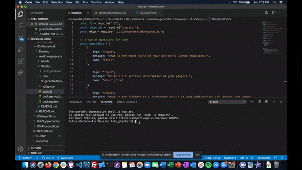
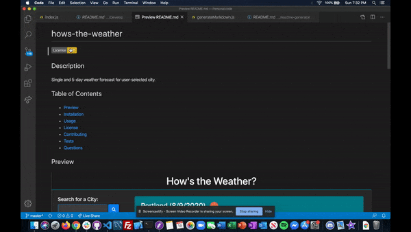

# readme-generator
  

## Description
Generates a detailed README.md file specific to the user's application. Application used to generate this README.md file.

## Table of Contents
- [Preview](#preview)
- [Installation](#installation)
- [Usage](#usage)
- [License](#license)
- [Contributing](#contributing)
- [Tests](#tests)
- [Questions](#questions)

## Preview  
#### Run via Command Line Tools  
  

#### Example File Output  

## Installation
Use the package manager npm to install readme-generator  
<pre><code>npm install readme-generator</code></pre>

## Usage
Install package and run using node.js.

## License  
Click on the badge (top of page) for this project's MIT licensing information.

## Contributing
Pull requests and stars are always welcome. For bugs and feature requests, [please submit an issue](https://github.com/ShepLT1/readme-generator/issues/new)

## Tests  
To run tests, run the following command:
<pre><code>npm test</pre></code>

## Questions
Please contact me with questions via email or Github  
 
lshepherd234@gmail.com  
[Github Profile](https://github.com/ShepLT1)